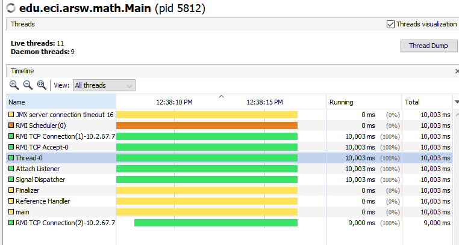
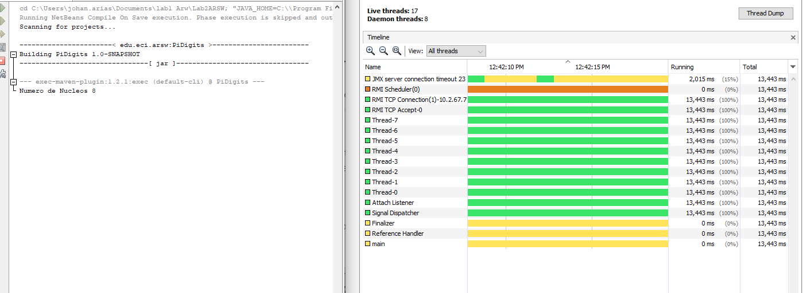
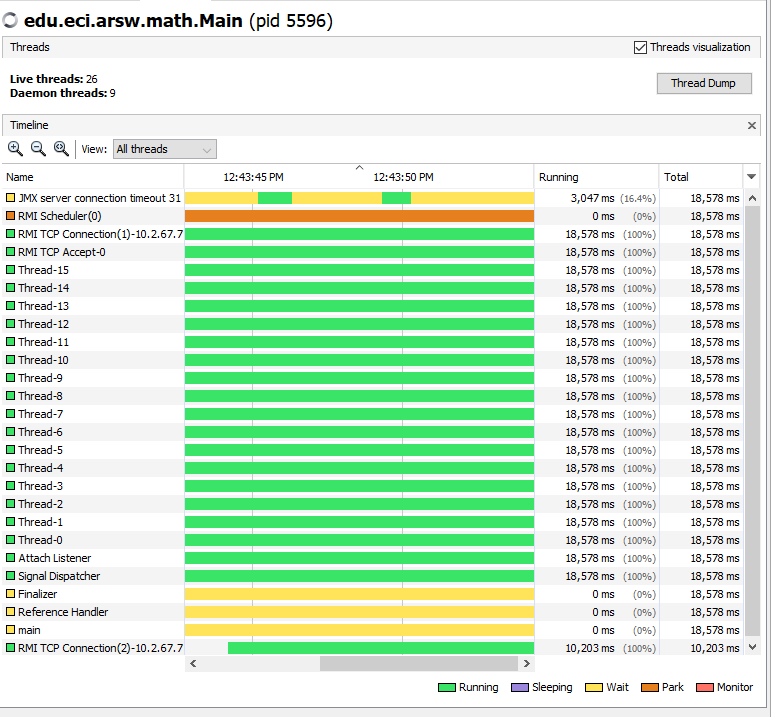
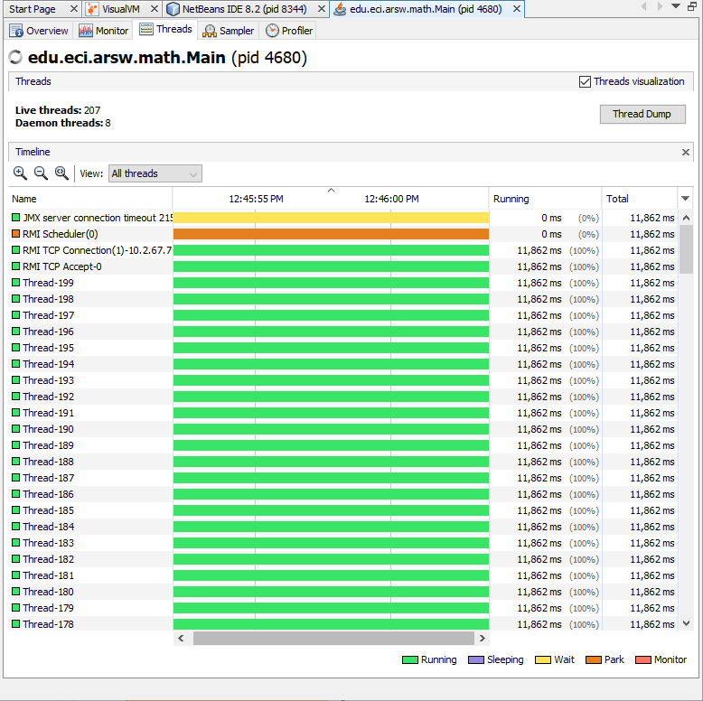

# Laboratorio 2 ARSW
## Integrantes:
- Andres Marcelo 
- Johan Arias
- Simon Marin
- Juan Garcia
# Como ejecutar el programa?
Primero que todo asegurese de tener Maven instalado en su equipo y tenerlo en el path de su S.O

Abra la consola y situese en donde descargo el programa, deberia quedarle algo asi el path: ``C:\Users\UExample\Downloads\Lab2ARSW>``

- Para compilar el proyecto ponga el siguiente comando: ``mvn compile``
- Para ejecutar las pruebas ponga el siguiente comando: `` mvn test``
- Para probar el programa usted mismo y poner casos ponga el siguiente comando:
``mvn exec:java -Dexec.mainClass="edu.eci.arsw.math.Main
``
A continuacion poner los parametros (cifra de inicio, numero de cifras y numero de hilos respectivamente) separados por lineas, de la siguiente forma:
> 0  
> 100  
> 20  

# Part I - Introduction to Java Threads
How does the output change if we use Run() or if we user Start() ? Why?
> Con start() el output **salta de numeros**, con run() ejecuta el codigo secuencialmente y **no hay saltos o cambios de orden** en el output, esto sucede debido a que si usamos el método **start ()**, se crea un nuevo Thread y el código dentro del método run() se ejecuta en un nuevo Thread, mientras que si llama al método **run()** directamente, no se crea un nuevo Thread y se ejecutará el código dentro de run() en el hilo actual.

## Part III - Performance Evaluation

Single thread. 

As many threads as processing cores (have the program determine this using the Runtime API). 

So many threads as double processing cores. 

200 threads

